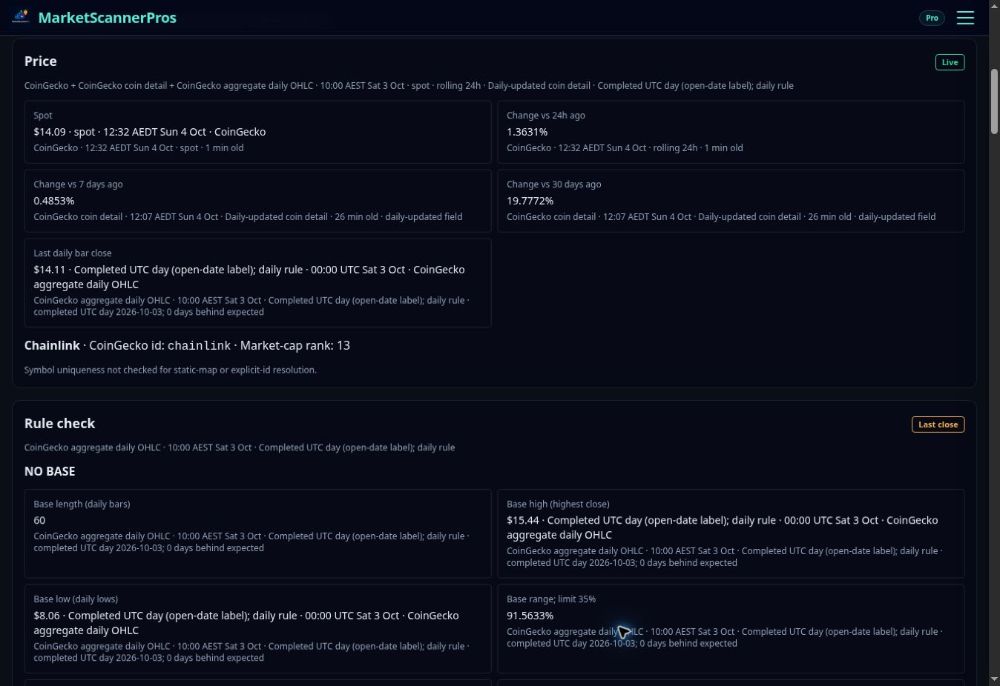

# Crypto top v1 — implementation and verification

Started from `084e14f0a7750de049b07f9f75cf3029c4f35880`; rebased cleanly onto current main `3879c5b6d931420b6cf05c45cfd973b6d03ecfb2` after PR #345 merged. Branch `crypto/top-v1`; seven ordered commits retained.

## Scope

Seven ordered commits implement the supplied 4 Oct 2026 top-section brief. The top reuses the already-loaded daily bars and section observations; it adds no endpoint, provider call, cache key, dependency, polling, scoring or rule change. The existing Golden Egg page and other pages are unchanged. Admin, operator, paper trading, pause flags, environment, migrations and deployment configuration are unchanged.

- T-1: optional top projection, coin/spot/change strip, exact stage and spot freshness, retained budget/identity warnings, old-response fallback.
- T-2: factual verdict and four accessible chips, shared formatting, locked V1 limits, null-to-dash behavior.
- T-3: plain SVG daily-close chart, latest 90 completed bars, missing-day breaks, base box and rule-stop level. Missing lows omit the box; fewer than two bars show an unavailable message. The caption states the actual number of bars shown (maximum 90), including partial-history cases.
- T-4: funding, open interest, volume/base median and rank. Derivatives keep their own timestamps and venue scope. Unlisted contracts and unavailable observations are explicit.
- T-5: all eleven detail sections retained; only Rule check starts open. Sources check explanation added.
- T-6: fluid two-column mobile chips/cards, wrapped long names, adaptive SVG width, 40px section header targets.
- T-7: regression tests and this evidence record.

## Test evidence

`npx tsc --noEmit` was run after every order. Full `npx vitest run` was also run after every order. New tests were observed failing before T-1 through T-6 implementation; the complete added coverage fails against the pre-feature implementation.

| Checkpoint | TypeScript | Test files | Tests |
|---|---|---|---|
| Before changes | Clean | 7 failed | 517 passed | 2 skipped (526) | 12 failed | 4686 passed | 13 skipped (4711) |
| T-1 | Clean | 7 failed | 519 passed | 2 skipped (528) | 10 failed | 4691 passed | 13 skipped (4714) |
| T-2 | Clean | 7 failed | 519 passed | 2 skipped (528) | 10 failed | 4693 passed | 13 skipped (4716) |
| T-3 | Clean | 7 failed | 519 passed | 2 skipped (528) | 10 failed | 4694 passed | 13 skipped (4717) |
| T-4 | Clean | 7 failed | 519 passed | 2 skipped (528) | 10 failed | 4696 passed | 13 skipped (4719) |
| T-5 | Clean | 7 failed | 519 passed | 2 skipped (528) | 10 failed | 4697 passed | 13 skipped (4720) |
| T-6 | Clean | 7 failed | 519 passed | 2 skipped (528) | 10 failed | 4698 passed | 13 skipped (4721) |
| T-7 | Clean | 7 failed | 519 passed | 2 skipped (528) | 10 failed | 4707 passed | 13 skipped (4730) |

After main moved, both the new main and the rebased branch were checked again. No overlapping files or manual conflict resolution were needed. The exact same ten failing cases occur on both. The chart-caption regression was observed red before its small correction.

| Checkpoint | TypeScript | Test files | Tests |
|---|---|---|---|
| Updated main 3879c5b6 | Clean | 7 failed | 525 passed | 2 skipped (534) | 10 failed | 4730 passed | 13 skipped (4753) |
| Final top branch | Clean | 7 failed | 527 passed | 2 skipped (536) | 10 failed | 4750 passed | 13 skipped (4773) |

Focused verification: `npx vitest run test/cryptoBreakdown*.test.*`: **69 passed in eight files**. Includes LINK-like NO BASE (91.6%, 0.58x), synthetic WATCH, KAS-like unlisted perpetual, missing top, missing bars/lows/times, gaps, all verdict stages, copy language, chip provenance, neutral derivatives, and all eleven disclosure defaults.

Transport is mocked throughout these crypto tests. The existing LINK fixture still makes **10 CoinGecko, 6 OKX and 1 Yahoo transport calls cold; zero additional provider calls on a warm reload**. Concurrent loads retain the original deduplication and budget assertions. The new chart equals the exact last 90 completed fixture bars. The full-page test still observes one breakdown fetch on load and a second only after Refresh.

These are code/test observations, not a claim that new code is deployed or providers were tested live.

### Baseline failures retained

Final suite has ten failing cases across seven files; each was already failing in the initial baseline (12 failures; two additional bulk-selection timeouts disappeared in subsequent runs):

- `backtestStrategySignals`: four cases receive 99 days where 100 are required.
- `bulkSelectionRoute`: one timeout (three timeouts in initial baseline).
- `cryptoScanAliasRows`: timeout.
- `commanderCommandState`: expected paused research-alert source text missing.
- `operatorMarketDataAccuracy`: cached daily bars spy expectation differs.
- `workerEquityBulkWiring`: quote upsert source guard differs.
- `intelligence/globalM2Reliability`: STALE versus LIVE expectation.

The brief also named `admin/cryptoAuditFixes`; it did not appear as a failure in this run. No baseline failures were repaired or weakened in this PR.

## Visual evidence and incomplete checks

The current live LINK Golden Egg page loaded successfully. The screenshot below is the **existing live page before this branch**, with live displayed data; it is not an after screenshot. The visible breakdown showed NO BASE, range 91.5633%, volume 0.5759x, and spot $14.09.

**Visual acceptance is incomplete.** The connected browser has no advertised viewport-size control; keyboard device-toolbar attempts did not change the viewport. A local-file preview was rejected by browser security policy (HTTP/HTTPS only). No alternate browser surface was used to bypass that rejection. Therefore the requested live 390px before image and local after screenshots (LINK desktop/390px, KAS-like 390px) are not supplied. No fixture image is represented as a live view. DOM/source tests pass, but they cannot prove actual mobile layout or absence of sideways overflow in the entire Golden Egg page.

Keep the PR draft pending these visual checks and CI review. No merge or deployment performed.

## Existing tests changed

- `cryptoBreakdownPage`: permits the new top wrapper in the existing digit guard and separately checks every numeric top text belongs to a block with its own source/time or PriceStamp. Existing assertions retained.
- `cryptoBreakdownTransport`: adds one top-projection test to the existing mocked-provider fixture, retaining its original call-count tests.
- Two new top test files cover pure transforms and rendered UI.

## Noticed, not changed

- `CryptoTerminalView` still uses inline `minWidth: 500`; this PR does not assert the whole site is mobile-clean.
- Yahoo helper supplies no observation timestamp and is excluded from fresh-source agreement.
- OKX seven-day OI history remains unavailable with only 25 hourly rows.
- The breakdown API route has authentication and input validation, but no per-route rate-limit check.
- GitHub reported the **Cloudflare Pages** check on base commit `084e14f0` completed with **failure** when checked during this task.
- The before screenshot predates the confluence PR #345 merge. Those changes are now inherited from main, with no additional edits to protected Golden Egg page code in this PR.

## Defaults used

1. Plain SVG, no canvas or new chart library.
2. Ninety completed daily bars.
3. Only Rule check open initially.
4. Existing Degraded label/color for spot age in its current intermediate band.
5. Negative extension keeps the locked rule's pass result and displayed value.
6. Exact stages, including MEETS v1 RULES; gray/slate/blue/amber tokens, no directional stage coloring.

## Before merge

- [ ] Capture before LINK live at 390px.
- [ ] Run this branch locally; capture LINK desktop/390px and KAS-like 390px; label live versus saved-fixture data.
- [ ] Check SVG labels, long names, all row toggles and no horizontal overflow at 390px.
- [ ] Review CI against the recorded baseline failures.

## After deployment (Brad merges)

- [ ] LINK: badge/verdict/chips match Rule check; chart levels match the underlying levels.
- [ ] QNT: same rule-stage and metric agreement; funding/OI state the exact OKX instrument.
- [ ] An unlisted-perpetual coin: explicit unavailable derivatives, remaining top intact.
- [ ] A symbol outside the static coin map: exact identity warning retained; chart displays actual bars or unavailable.
- [ ] Compare top funding/OI/rank with Derivatives/Supply and verify missing timestamps warn.
- [ ] Reload within spot TTL; confirm no additional provider credits as in the mocked transport test.
- [ ] Confirm only Rule check starts open and the other ten disclosures work.
- [ ] Confirm admin/paper settings unchanged; record the single intended Render build after merge.
