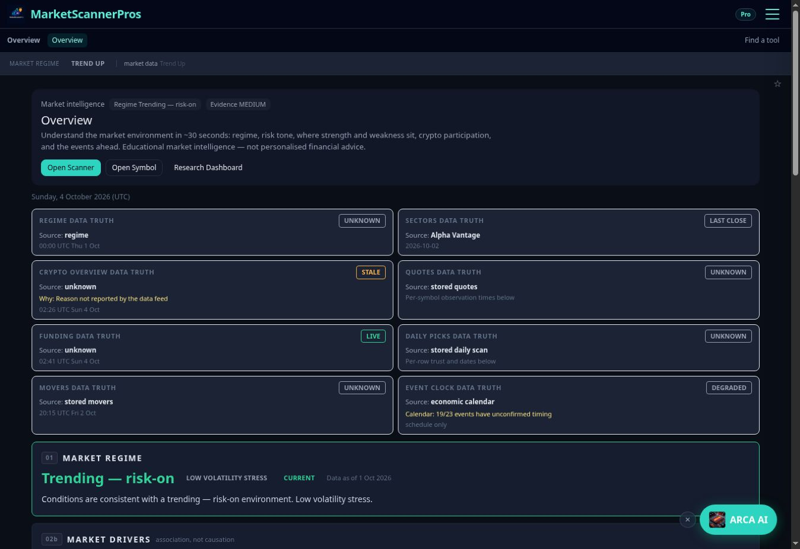

# Phase 1: menu, Daily Radar, Overview Today strip

Base: `325d117d3798f2b9e23df0dbe9cd3d893aacd988` (main after #346 merged).
Branch: `phase1/v1`. Six ordered commits; one draft PR. No merge or deployment performed.

## Changes by order

1. **P1-1:** Overview, Daily Radar, Scanner, Symbol, Options, Track. Daily Radar has its own active area. Desktop Account is a keyboard-accessible dropdown; the drawer has the same Account links. Single-link workflow bars are hidden; Track retains its tabs. Symbol handoff and drawer focus trap remain.
2. **P1-2:** Overview's Radar card fetches only after Pro/legacy Pro/admin access resolves. Free/logged-out visitors make zero Radar calls. One request per mount/access resolution, with abort cleanup and no polling/archive request. Only session date, status, health, count and generated time reach the UI. HTTP errors and network failures have explicit safe text; no raw response/error body, headline, symbols, scores or ops are rendered.
3. **P1-3:** Existing regime, bulk quotes and sector data feed the Today strip. Sector cells sort by observed change and preserve null. Four stamped stat cards show BTC, ETH, SPY and sectors up. Missing SPY is `no quote`. Eight existing Data Truth items are unchanged inside a closed disclosure. All content from the original Market Regime section onward is byte-for-byte unchanged.
4. **P1-4:** PageHero supports `titleAs`, defaulting to h1. Symbol passes h2 and removes only the two header composite displays, for both equities and crypto. The lower composite block, score calculations, AI context and canonical tooltip remain.
5. **P1-5:** Rendered access/navigation/error-state tests, pure model checks, source scope/copy guards and Symbol heading tests. Every network request in these tests is mocked.
6. **P1-6:** Two-column phone stats, shrinking 11-cell heat strip, 40px minimum menu controls, right-aligned Account menu, hydrated viewer-local date and mobile source guards. On small screens cell percentages are available through titles/accessible text; ticker labels and `n/a` remain visible. The shared caption stamps the whole heat strip.

Plain CSS heat strip; no chart package or other dependency added. New authored UI text is in `components/visual/copy.ts`.

## Data semantics

- Regime freshness has the same loading/unavailable/stale/current precedence as the existing Regime card.
- Sectors up uses the existing `rankSectorStrength`: denominator is the number with valid changes, not a fabricated 11 when data is missing. With 11 valid sectors it is x / 11; with one null it is x / 10. The heat strip still retains all 11 cells.
- A date-only sector observation retains its New York session date and explicitly says `time unknown`; no close timestamp is invented. Instant observations render in the viewer's zone with a zone tag.
- `dataStatusSummary` counts degraded and stale independently. Not-timed means no valid computed time or dated/timed observation note; Unknown health does not erase an existing timestamp. The eight source items were not changed.
- Overview's visible title stays in PageHero once; the regime strip uses Overview as its accessible label, rather than repeating a visible page title.

## Checks and red/green evidence

Commands after every order: `npx tsc --noEmit`; `env -u CRYPTO_SUMMARY_KEY npx vitest run`.

| Stage | TypeScript | Passed | Failed | Skipped |
|---|---:|---:|---:|---:|
| Current-main baseline | clean | 4750 | 10 | 13 |
| P1-1 | clean | 4750 | 10 | 13 |
| P1-2 | clean | 4752 | 11 | 13 |
| P1-3 | clean | 4755 | 10 | 13 |
| P1-4 | clean | 4757 | 10 | 13 |
| P1-5 | clean | 4790 | 10 | 13 |
| P1-6 | clean | 4791 | 10 | 13 |
| Final after accent CSS correction | clean | 4789 | 12 | 13 |

All **41 Phase 1 tests pass**. Final full run: 539 files, 4814 tests. No Phase 1 failures. Variation is in existing scanner timeout cases, not suppressed or edited tests. A fresh detached checkout of the base reproduced the bulk scanner timeout (1 failed / 5 passed); a focused branch comparison plus all Phase 1 tests was also run.

Red checks before implementation: menu order failed on five destinations; Radar/Today model tests failed before their modules existed; Symbol heading/header tests failed before h2 and score removal; phone guard failed before minimum tap targets. P1-5 expands those regressions with mounted component tests. CSS was compiled with the installed Tailwind/PostCSS packages; this found unsupported accent opacity classes, which were corrected to supported CSS-variable classes before publication.

Baseline failures left untouched:

- `backtestStrategySignals`: four cases, 99 daily bars vs required 100.
- `bulkSelectionRoute`: one to three intermittent 5-second timeouts (three in final run).
- `cryptoScanAliasRows`: one 5-second timeout.
- `commanderCommandState`: stale source assertion for `RESEARCH ALERTS PAUSED`.
- `operatorMarketDataAccuracy`: cached daily-bars spy assertion.
- `workerEquityBulkWiring`: existing quote-column source assertion.
- `intelligence/globalM2Reliability`: STALE vs LIVE assertion.
- `admin/cryptoAuditFixes` passed with `CRYPTO_SUMMARY_KEY` unset.

`git diff --check` clean. Protected paths, provider logic, dependencies and runtime config unchanged. Existing lower Overview sections compared directly against base and match exactly.

## Visual evidence — incomplete, draft gate

Before images below are **live Pro session** screenshots from 4 Oct 2026, at the browser's actual **1348 × 926** viewport. They are not 1280px or 390px emulations and not fixtures.

| Page | Before | After |
|---|---|---|
| Overview | [Live Pro](screenshots/before-overview-pro.jpg) | blocked |
| Daily Radar | [Live Pro](screenshots/before-radar-pro.jpg) | blocked |
| AAPL Symbol | [Live Pro](screenshots/before-aapl-pro.jpg) | blocked |
| Open drawer | [Live Pro](screenshots/before-drawer-pro.jpg) | blocked |

Local Next dev initially failed on the shared node_modules symlink in Turbopack. `next dev --webpack` started successfully. The connected browser then rejected `http://localhost:3100/tools/command-center` with `net::ERR_BLOCKED_BY_CLIENT`. No alternate network route or browser bypass was attempted. The browser has no supported viewport-resize capability. Local server was stopped after this check.

**Still required before marking ready:** local/preview after screenshots and visual overflow checks for Overview, Radar, AAPL and the drawer at 1280px and 390px, with Pro and Free fixtures/accounts; complete the matching before matrix where available. Free access and mobile CSS are tested in code, not claimed as observed browser results. No account tier was changed and no deployment was triggered to obtain screenshots.

The live Radar before view contained the Fri 2 Oct COMPLETE/NORMAL report with 10 candidates; the card's tests deliberately use a clearly separate 12-candidate fixture. No claim is made that the new card is deployed.

## Existing tests changed

Only three existing files: `layoutNavigation.test.ts` (six ordered labels/hrefs), `layoutFlowAudit.test.ts` (six labels plus Radar area links), `researchReadiness.test.ts` (six labels/test title). `diamondHunterRemoved`, `layoutOverview`, `regimeHonestDefault`, `sessionDataHealth` and `confluenceLabels` passed unchanged.

## Shared files with #346

None of #346's protected files edited: `components/crypto/*`, `lib/crypto/breakdown/*`, `test/cryptoBreakdown*`, `docs/crypto-top-v1/*`. #346 was already merged at the base. Golden Egg's only changes are in the shared PageHero call. ToolsNavBar/operator source is untouched; its shared menu import now includes Daily Radar automatically.

## Defaults used

Account dropdown plus drawer group; sector heat strip; no Radar headline; remove composite header display for both equities and crypto; sectors up as fourth card; defer symbol redirect, All tools regrouping and remaining forex copy. No scoring, permissions or trading changes.

## Noticed, not changed

Starting-list items from the brief (not newly audited here): `/tools/symbol/X` 404; All tools' three Options cards remain ungrouped; AI help forex wording; duplicate Track tabs; Overview derivatives link opens the market page; MarketStatusStrip can say Unknown despite an observation time. ToolsNavBar now inherits Daily Radar without a source edit.

The requested 1280px desktop capture is below the retained 1440px navigation breakpoint, so it shows the drawer control. Full desktop menu interaction also needs a viewport of at least 1440px.

## Post-merge checklist (Brad/Pip)

Verify all six destinations and their active state; Account menu; no repeated single-link bars; Track tabs retained; phone no overflow; compare Today values with lower sections; compare Radar card with report page; confirm zero Radar request for Free/logged-out visitors; expand the eight status items; AAPL one h1/no header composite; BTC protected breakdown intact; admin/operator still load; record the single Render build on merge. This branch has not been deployed or merged.
