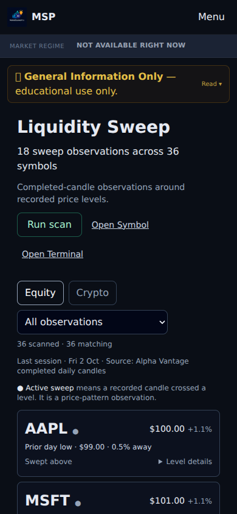

# Liquidity Sweep — Job B visual acceptance, 5 October 2026

Draft UI evidence; **mocked browser fixtures, not a live scan or provider acceptance**. Research/simulation only, general information, not financial advice. No merges authorized.

Base: `batch/oct-wp` at `03946b7e54a3aae344e05c0f179907fe0ca9e098`. The before build is the already-built Symbol baseline `9b8d93a8`; its Sweep page blob `0672a5cfc8808a9490d4cb58f7e0c446157aa235` is byte-identical to this batch base. Shared chrome can differ between these branches; counts include the complete rendered page and shared chrome.

## What changed

Six observations in existing provider order, with Show all and Show top 6. One Active sweep legend, neutral cards, one scan button, plain level names, readable values, closed per-card details, one date/source line using the response's candle dates. Mixed dates remain explicitly mixed. The duplicate hero/metrics/example result are removed. Links say Symbol; routes remain unchanged.

The existing shared `LockedPreview` component now handles free/anonymous access. The batch page previously rendered an Example block, so this is a presentation correction, not a claim that its old markup already used LockedPreview. Existing tier helpers, paid API enforcement, cache keys and once-per-session auto-scan behavior are retained. Switching asset modes requires the existing Run scan action if that session already scanned. Show all and filters do not request data.

No API, scoring, pattern, provider, storage, worker, or shared navigation implementation changed. Existing disclosure wording is preserved verbatim.

## Eight-point gate

| Gate | Evidence / result |
|---|---|
| One verdict above first fold | PASS: exactly one Sweep verdict, top 205px desktop / 236.5px phone. |
| About two screens, folds closed | PASS: 1.093 desktop / 1.951 phone, equity and crypto; before 5.014 / 15.615 with 36 rows. |
| No sideways scroll at 390 | PASS: document scrollWidth=390, viewport390×844. |
| No fake/empty tools | PASS for paid scan UI: 6 actual response rows, Show all 36, explicit unrun/error/empty states. Existing shared locked preview intentionally retained for free/anonymous, tested without requests. |
| No banned/engine words | PASS in revised paid body and expanded level details: no PDL/EQH/raw setup codes/Golden Egg or action instructions. Protected educational disclosure retains buy/sell and stop-hunt wording; global missing-regime banner is outside this patch. |
| Readable numbers + one source | PASS: one source/date line, one legend, $100.00 / +1.1% / 0.5%; mixed-session helper coverage. Scores unchanged. |
| Screenshots1280 and 390 | PASS: before/after equity+crypto full pages and first viewports below. |
| Symbol / Overview / Track naming | PASS: Open Symbol; existing route remains /tools/golden-egg. |

## Screenshot evidence

Viewport sizes are exactly 1280×800 and 390×844; Essential Only dismissed; details closed. Raw observation times, rendered text, requests, dimensions and expanded-card checks are in [after/evidence.json](after/evidence.json) and [before/evidence.json](before/evidence.json). Observation times are capture times, not provider timestamps. Fixture candle date is 2 October 2026.

| Case | Before | After | After first viewport |
|---|---|---|---|
| Equity1280 | [Full](before/equity-1280-closed.png) | [Full](after/equity-1280-closed.png) | [First fold](after/equity-1280-viewport.png) |
| Equity390 | [Full](before/equity-390-closed.png) | [Full](after/equity-390-closed.png) | [First fold](after/equity-390-viewport.png) |
| Crypto1280 | [Full](before/crypto-1280-closed.png) | [Full](after/crypto-1280-closed.png) | [First fold](after/crypto-1280-viewport.png) |
| Crypto390 | [Full](before/crypto-390-closed.png) | [Full](after/crypto-390-closed.png) | [First fold](after/crypto-390-viewport.png) |

## Verification

- Production `next build` with dummy STRIPE_SECRET_KEY, OPENAI_API_KEY, STRIPE_WEBHOOK_SECRET, DATABASE_URL and APP_SIGNING_SECRET: exit 0. An initial rerun without dummy env failed collecting an unrelated admin route; corrected dummy-env build passed.
- `tsc --noEmit`: exit 0.
- Focused rendered/regression tests: 37/37 pass across liquiditySweepCompact, phase2cReviewFixes and layoutFlowAudit. Old source assertions for the removed duplicate hero/example block were updated only for Sweep. [Output](focused.txt).
- Same new rendered test against byte-identical old Sweep page: 5 fail/1 pass; expected missing compact rows, fake examples and access presentation. [Before output](baseline-red.txt).
- Full Vitest with CRYPTO_SUMMARY_KEY and OPENAI_API_KEY unset completed before a separate Commodities run's automatic-review warning: 4952 pass, 11 fail, 13 skip across 572 files. Failing files: backtestStrategySignals (4 date-sensitive cases), bulkSelectionRoute (2 timeouts), cryptoScanAliasRows (1 timeout), commanderCommandState, operatorMarketDataAccuracy, workerEquityBulkWiring, intelligence/globalM2Reliability. These match the existing baseline failure families; no unrelated production/test fixes attempted. The suite is not green.
- Further full-suite runs are blocked: automatic review cited an external FRED provider request in the parallel Commodities verification. No rerun or bypass is attempted. These full-suite results must not be presented as guaranteed network-isolated evidence.
- Browser capture intercepted every `/api/*` request, including scan POST, and blocked all external origins; no browser request reached a provider or production API. Browser scenarios have no page errors. Show all→36→Show top 6 returns 6 without another scan in all four scenarios; expanded details contain plain labels.

`capture.cjs` records the synthetic response and capture procedure. It needs Playwright plus a local Chromium executable and a pre-built checkout (`SWEEP_WORKTREE`, `SWEEP_SCREEN_DIR`); paths in this audit script identify the validation environment. It is not product polling or production automation.

Live authenticated provider validation remains pending; these screenshots prove rendering only. Brad/Pip review requested before batch merge.

## Follow-up review correction

HTTP failure status remains visible: 401/403 explain access, 429 asks the viewer to wait, and other failures allow retry. Three mocked status cases pass; no automatic retries added. Build and TypeScript passed again after this correction. Success-state screenshot markup is unchanged. No further full-suite run.
