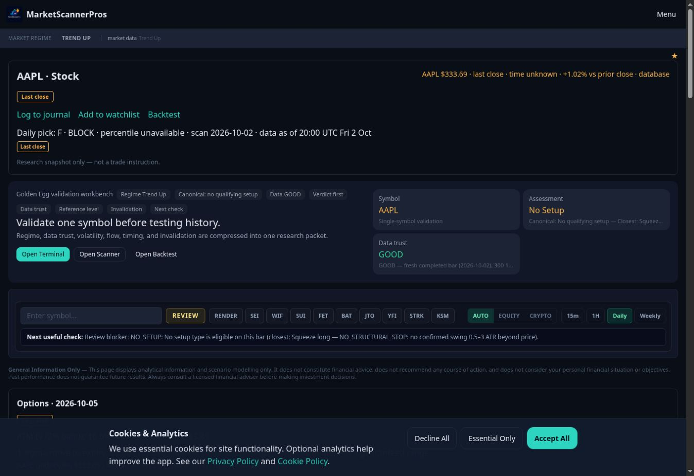
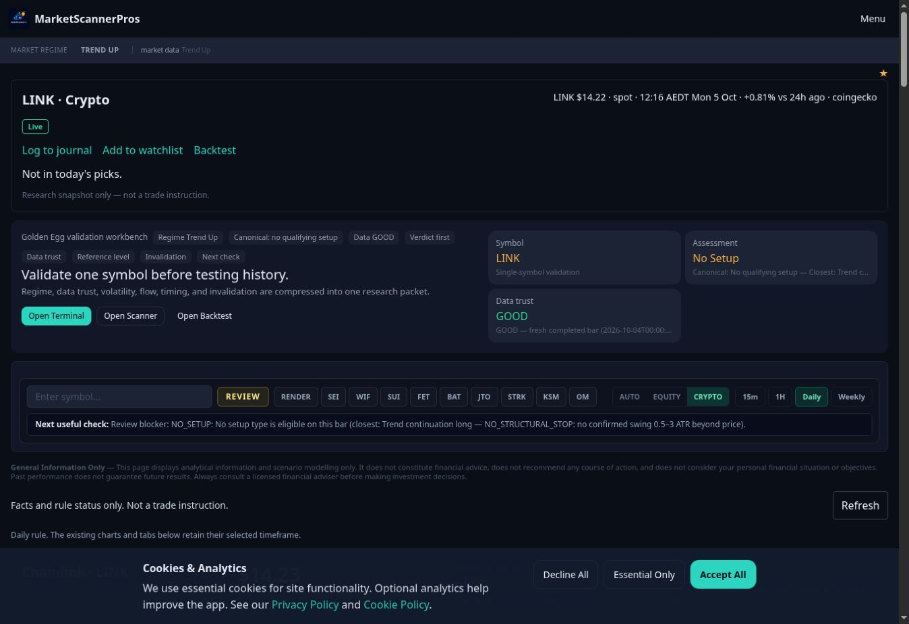

# WP1: Symbol layout — draft, not merge-ready

Base main: `f33130bd969238fc3e959049df1cbd48c819ae04` (#348–#352).
Branch: `phase2d/symbol`. Reviewed supplied spec.md, symbol.html and all four stock/crypto PNG references. No mockup numbers enter the product.

## Implemented

- WP1-1: shared `SymbolSummary`, `BaseChart`, `RuleChips` and `StatCards` for equities and crypto. Stock chart reads the existing `/api/bars` endpoint once per symbol; no polling or scan request. The 50-observation average is a chart overlay, never an input to a verdict. Existing crypto rule classifications remain unchanged.
- WP1-2/3: remove the repeated hero and large input block; compact picker retains asset/timeframe controls. Stock scenario, options, fundamentals, evidence, deep analysis and backtest are closed folds/chips. Legacy tools and packet retained inside the detail fold. Heavy child tools mount only after the user opens a fold.
- WP1-4/5: compact crypto key-level tiles, four genuine rule checks, folded details, one evidence chip row and one page-bottom SourceLine. Neutral chart with green/red/amber states. Compact header has one h1 and journal/watchlist/backtest draft links.
- WP1-6: reuse the existing 401/403 classification and untouched #348 LockedPreview block. Unknown quote labels omitted from the compact header; failed paid feeds remain visible as amber faults. No access rules changed.
- WP1-7 / Y8: secondary composite stays inside the legacy detail fold, with its existing wording and values. Its score is not repeated in the fold summary.
- No-symbol URL defaults to AAPL. Existing journal handoff remains a draft link; no journal row writes added.

## Required acceptance still open — do not merge

1. **Visual evidence:** no 390×844 / 1280×800 before/after, no Free/Pro/signed-out after screenshots, and no verified ≤2-screen result yet. The available browser has a fixed 1363×936 viewport and no supported viewport-resize method. Local preview access was previously blocked by browser policy; no alternate route was used to bypass it. Pip needs to run the required preview matrix.
2. **Stock stages/base box:** the existing equity packet has canonical verdict/factors/levels but no numbered stock stage or base-box interval. The chart draws supplied key levels and preserves the existing assessment. It does not derive stock stages using crypto rules or invent a base. Completing the exact mockup needs an approved existing source for those fields.
3. **Rules/rank:** crypto has four locked v1 checks, not five. All four are preserved. Daily picks expose grade/date, not numeric rank; stock tile is honestly labelled Daily pick grade. Crypto market-cap rank retains that label. Numerical daily rank is not invented.
4. **Expanded legacy views:** these are retained, not comprehensively redesigned. The closed view removes their raw status blocks from the DOM, but a full raw-word, colour, source-count and single-h1 audit after opening every legacy tab still needs completion. The shared outer regime pill is unchanged (WP7).
5. **Live parity:** AAPL/NVDA/BTC fixture JSON is unchanged by rendering; scoring/rule files and `app/v2/_lib/api.ts` are untouched. A live before/after JSON comparison is still pending.

## Validation

- `timeout 1500 npx next build`: **exit 0**, using the brief's dummy credentials. Full [build log](build.log). Restored `next-env.d.ts` afterwards. Initial build failed because Turbopack does not accept an external node_modules symlink; a local dependency copy resolved this without package/lock/config changes.
- `npx tsc --noEmit`: exit 0 (final confirmation recorded before publication).
- Full suite: **4,905 passed, 10 failed, 13 skipped**, 560 files. All failures in the same seven files reproduced on clean main (main: 4,896 passed, 10 failed, 13 skipped, 559 files). The changing count is from timeouts in bulk/backtest tests. See [head](tests-head.txt) and [main](tests-main.txt).
- Four brief-listed main failures: commanderCommandState, operatorMarketDataAccuracy, workerEquityBulkWiring, intelligence/globalM2Reliability.
- Three additional failures verified on this exact main: backtestStrategySignals, bulkSelectionRoute, cryptoScanAliasRows. No unrelated logic/tests changed to make them green.
- Behavioral fail-before proof using only components that exist on main: **5 failed / 1 passed** on main. Failures cover compact shared presentation, closed native folds/source count, deferred heavy children, raw quote labels and feed-error wording. [Before report](regressions-before.txt).
- Final focused checks: **33 passed / 5 files**, including client boundary and free/signed-out gates.
- New render coverage: shared equity/crypto parts, no payload mutation, no invented stock base, one source, folds closed, evidence disclosure, missing quote, paid-feed failure distinct from a tier gate. Existing free-tier tests continue checking real-price + locked-card versus sign-in. Added AAPL default/raw-word gate check.
- Existing source-string tests were adjusted only where the brief deliberately replaces old hero labels/layout. New behavior is covered by render tests.
- Protected #348 LockedPreview block verified byte-identical. No protected path, provider, polling, migration, storage, environment configuration, package, worker, scoring or disclosure changes.

## Screen-count record

These available baseline observations are **not substitutes** for the required widths. Cookies banner was visible; no account changes were made.

| Page / Pro | Before at 1363×936 | Before 390×844 | Before 1280×800 | After required widths |
|---|---:|---|---|---|
| AAPL | 4,826 px / 5.156 screens | Pending | Pending | Pending |
| LINK | 7,506 px / 8.019 screens | Pending | Pending | Pending |

## Defaults and noticed, not changed

- Y8: secondary composite retained unchanged inside detail. No section-4 approval assumed.
- Y11: auth/gates, LockedPreview copy, legal/disclosure copy and API behavior unchanged.
- Some requested mockup fields have no counterpart in current responses (listed above).
- Closed legacy detail is a useful intermediate compact layout, not evidence that all expanded content now passes the complete WP1 standard.
- Browser verification and the data-contract gaps keep this PR a draft. WP2 must wait for WP1 merge; no later package started.
