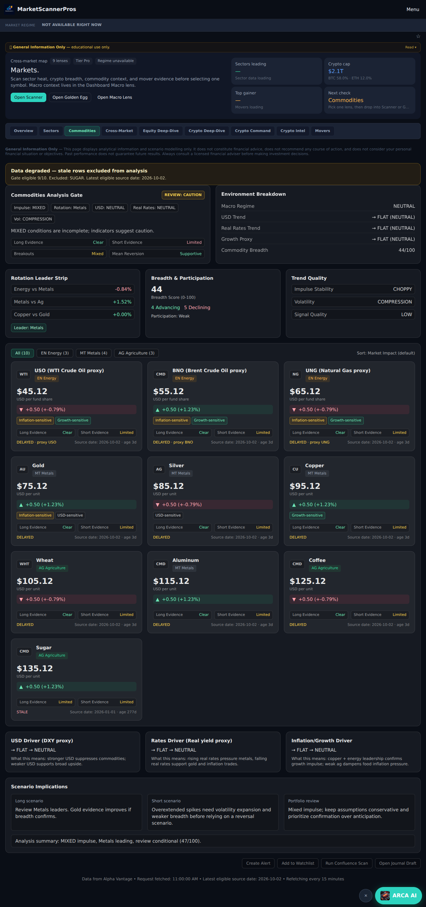
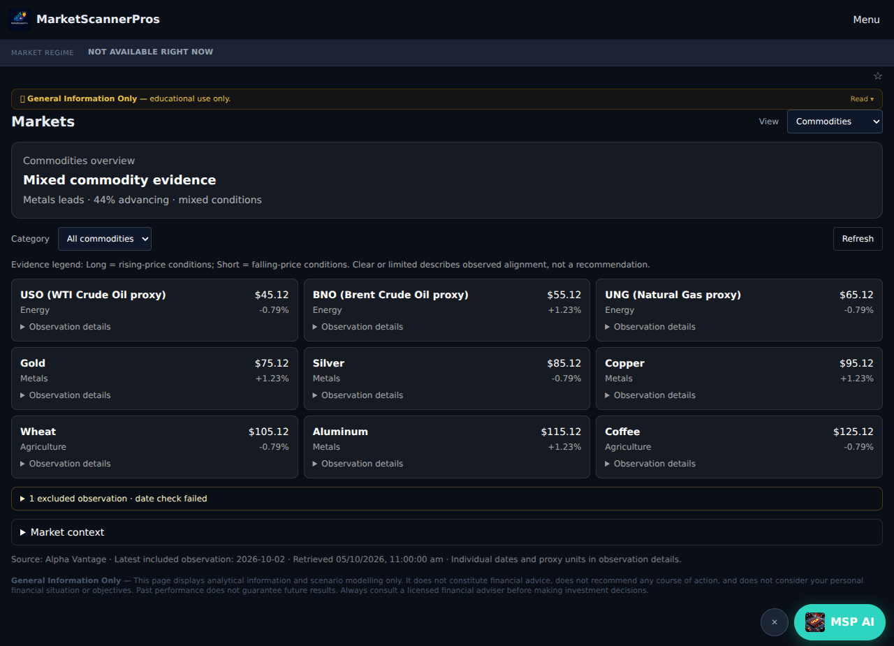
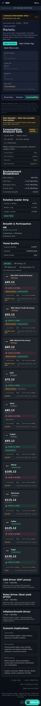
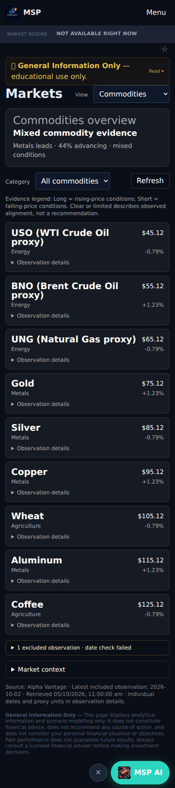

# Commodities UI review — 5 October 2026

Date-check follow-up: the excluded chip says “date check failed”, covering both expired observations and missing/invalid dates. The mocked rendered regression includes an unreadable date; API eligibility rules are unchanged.

UI-only Job D, with Job E's Markets copy changes. Base: `batch/oct-wp` at `03946b7e54a3aae344e05c0f179907fe0ca9e098`.

The old deep view repeated evidence labels on every card and displayed excluded observations at full size. The new view has one verdict, compact included rows, one evidence legend, and closed folds for excluded observations and market context. The Markets view selector is compact only on the Commodities tab. Routes and existing free/Pro access remain unchanged.

All screenshots are **mocked UI evidence**, not live-provider verification. Ten fixture rows include nine eligible rows and one excluded older Sugar observation. Browser requests to every API are mocked and external requests blocked. Screenshots do not establish provider accuracy. Before uses the existing built `symbol-w1-baseline` snapshot: its commodity page blob `616bce7b487c8cca9582732ab61cf49459a55610` exactly matches the batch base; its shared Explorer wrapper predates the batch's minor Symbol navigation wiring. After uses this draft. Raw browser observations, dimensions, request interception and text are in each evidence JSON.

| Layout gate | Evidence |
|---|---|
| One verdict above fold | Desktop y244; phone y280.5; one `data-commodity-verdict` |
| About two screens closed | Desktop 3.40 → 1.16; phone 7.76 → 2.07 (800/844 height) |
| No sideways scroll at 390 | Document width exactly 390; desktop 1280 |
| No fake/empty tools | Fixture-backed rows; no disabled coming-soon action buttons; empty category explains missing included observations |
| Plain wording | Closed view has no engine codes; context enums rendered as plain lowercase words. Existing card freshness footer is intentionally unchanged pending #367 |
| Readable numbers + one source | Two decimal price/change presentation; one source line closed. Per-row dates/proxy units remain accessible in observation details |
| Screenshots | Before/after 1280 and 390 below |
| Symbol / Overview / Track naming | Markets links and aria labels say Symbol; routes unchanged |

| View | Before | After |
|---|---|---|
| 1280 × 800 |  |  |
| 390 × 844 |  |  |

## Validation

- Focused mocked rendered regression: 1 passed. Same test fails against the unchanged commodity-page baseline because compact card markers/folding do not exist.
- TypeScript: exit 0. Production Next build with dummy environment: exit 0.
- Full Vitest run was interrupted by automatic approval review, which reported an external FRED provider request conflicting with the no-provider-run restriction. No full-suite pass is claimed and the run was not retried. Existing test logs include mocked FRED errors; the review did not identify a specific URL. Full suite remains blocked pending safe test isolation or explicit authorization.
- `derivedState` calculation checked byte-for-byte unchanged. Fetch/cache/polling and API files unchanged. Protected compliance disclosure unchanged.
- React review: native accessible selects/details; no extra fetch on filtering; no new effect/listener/polling; existing dynamic loading retained.

## #367 integration

This draft does not implement data-truth freshness logic. The exact existing card footer expression and color classes are retained inside the Observation details fold so #367 can supply `commodityCardStatusLabel` there. Expanded cards still carry the pre-#367 status wording until that separate change lands; do not claim that freshness issue fixed by this UI draft. No scoring, backend, workers, Stripe, auth, pricing, or legal edits.

Review requested from Brad/Pip. No merge performed.
